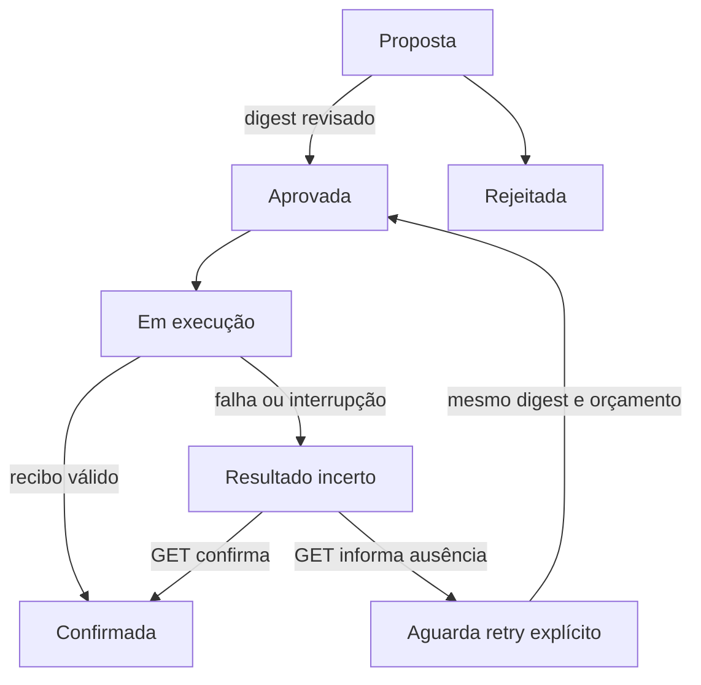

# Escritas aprovadas e recuperação — fase 0.6

A única operação desta versão é `record.create`: criar um registro imutável em um serviço HTTP configurado pelo operador. A intenção, sua aprovação, as reservas de execução e o recibo são persistidos no estado da missão. Modelo e Python não recebem a capacidade de propor, aprovar ou executar escritas por esse adaptador.

## Contrato e limites

O destino deve implementar `GET /v1/records/{action_id}` e `PUT /v1/records/{action_id}`. O ID é estável e aleatório, gerado quando a intenção é proposta. O corpo do PUT contém `action_id`, `digest` e `payload` (`name`, `content`).

- GET: `404` quando ausente; `200` com recibo quando confirmado.
- PUT: cria atomicamente o registro e sua identidade de recibo; retorna `201`. Repetir ID, digest e conteúdo retorna o mesmo recibo, com `200`, sem novo efeito.
- Reutilizar ID com conteúdo ou digest diferente retorna `409`.
- O recibo contém `action_id`, `digest`, `record_id` igual ao ID e `status: committed`. Os quatro campos são verificados pelo AgentOS.

**A prevenção de duplicações depende desse contrato no destino.** O método HTTP, sozinho, não garante idempotência de uma implementação. O serviço deve reter registros/recibos por todo o horizonte de recuperação e restaurá-los de forma consistente. O AgentOS não transforma endpoints arbitrários em operações seguras nem promete execução única universal.

O serviço de referência `examples/write_service.py` implementa o efeito e o registro de idempotência na mesma transação SQLite, com chave primária por ID e `synchronous=FULL`. Não executa efeitos externos adicionais. Ele é um exemplo local, não um gateway para sistemas de produção.

## Exemplo completo

Primeiro, em um terminal, inicie o serviço local com token próprio:

```bash
export AGENTOS_WRITE_TOKEN="$(python3 -c 'import secrets; print(secrets.token_hex(32))')"
python3 examples/write_service.py --db /tmp/agentos-records.sqlite3 --port 8090
```

No terminal do AgentOS, disponibilize o mesmo `AGENTOS_WRITE_TOKEN` por um canal seguro. Ele não é gravado no estado nem passado ao Python. Configure `AGENTOS_IMAGE` conforme o README e crie uma missão:

```bash
./agentos init --state state/escrita \
  --image "$AGENTOS_IMAGE" --workspace examples/data \
  --script examples/analyze.py --cycles 1 \
  --mission "Registrar resultado autorizado" \
  --write-endpoint http://127.0.0.1:8090 --write-max-attempts 3

cat > /tmp/agentos-payload.json <<'JSON'
{"name":"Resultado revisado","content":"Registro autorizado pelo operador."}
JSON

./agentos action-propose --state state/escrita --payload /tmp/agentos-payload.json
```

Revise a intenção retornada: ID, endpoint, operação, conteúdo e digest. Copie o ID e o digest efetivamente revisados:

```bash
./agentos action-approve --state state/escrita --intent ID --digest DIGEST
./agentos run --state state/escrita
./agentos status --state state/escrita
```

O protocolo processa as ações antes dos ciclos Python, sem consumir orçamento LLM. Uma intenção proposta bloqueia a fila até aprovação ou rejeição; o processo permanece aguardando, sem consultar o destino. A configuração de escrita não exige LLM. Estados antigos continuam sem escrita habilitada.

Uma vez aprovado, `run`/`serve` confirma a reserva local, consulta o ID no destino e envia PUT apenas se a consulta retornar ausência. Um registro já confirmado é reconciliado sem reenvio. O recibo é confirmado no snapshot antes de prosseguir para o próximo trabalho.

Para executar apenas uma intenção, use `action-run --intent ID`. Esse comando exige missão ativa. Para rejeitar uma intenção nunca iniciada, use `action-reject --intent ID --digest DIGEST`. Não existe edição de intenção: rejeite a original antes de iniciá-la e proponha outra, exigindo nova aprovação.

## Estados e aprovação



O digest SHA-256 é calculado sobre uma representação JSON fixa que inclui identidade da missão, ID da intenção, operação, endpoint e conteúdo. A aprovação armazena esse digest exato. Ele é recalculado no carregamento e antes da execução; mudanças nos campos vinculados invalidam a intenção. Não é assinatura digital e não protege contra um administrador que reescreva deliberadamente todo o estado.

Ao iniciar qualquer operação de rede, o AgentOS grava `in_flight` e as reservas. Um reinício que encontre esse marcador faz somente GET, mesmo que a falha tenha ocorrido antes do PUT. Não há reenvio automático de uma operação de resultado desconhecido.

## Falhas, pausa e cancelamento

Erros de rede, credenciais ausentes, status inesperado e recibos incompatíveis deixam a ação como `unknown` e pausam a missão. A memória analítica e os resultados anteriores permanecem. Pare o processo para usar os comandos CLI, pois o estado mantém o lock exclusivo:

```bash
./agentos action-reconcile --state state/escrita --intent ID
./agentos status --state state/escrita
```

A reconciliação é somente leitura e pode ser feita com a missão pausada ou cancelada. Se encontrar recibo válido, registra o sucesso sem mudar o estado administrativo da missão. Em `run`/`serve`, retomar a missão também permite reconciliar automaticamente uma ação incerta.

Se GET informar ausência, a ação passa a `retry_required`. Isso não prova que uma requisição antiga em trânsito nunca produzirá efeito. Uma nova tentativa precisa de autorização explícita e reutiliza exatamente o mesmo ID e digest, amparada pela idempotência do destino:

```bash
./agentos action-retry --state state/escrita --intent ID --digest DIGEST
./agentos resume --state state/escrita
./agentos run --state state/escrita
```

Uma ação que já reservou escrita não pode ser marcada como rejeitada: ela pode ter efeito externo pendente. É possível cancelar a missão para impedir novos PUTs e continuar a reconciliação por CLI. Pausa/cancelamento cancela o contexto local, mas não desfaz solicitações já enviadas. Recibos de escrita não são descartados como resultados tardios de leitura; registram efeitos que podem já existir no destino.

Depois de confirmada uma ação, sua repetição pela CLI é bloqueada. Uma nova proposta recebe outro ID e representa outro efeito, mesmo com conteúdo igual; não há deduplicação semântica entre propostas.

## Controle durante `serve`

A API local autenticada aceita:

| POST | Corpo JSON |
|---|---|
| `/v1/actions/propose` | `{"payload":{"name":"Nome","content":"Conteúdo"}}` |
| `/v1/actions/approve` | `{"id":"ID","digest":"DIGEST"}` |
| `/v1/actions/reject` | `{"id":"ID","digest":"DIGEST"}` |
| `/v1/actions/retry` | `{"id":"ID","digest":"DIGEST"}` |

As rotas usam `AGENTOS_API_TOKEN`, diferente do token do destino. Consulte intenções e recibos em `GET /v1/state`. Pedidos durante uma execução retornam `409`; tente novamente após ela terminar. Depois de aprovada, a ação é processada pelo worker quando a missão estiver ativa. A reconciliação manual de uma missão cancelada é feita via CLI, com o serviço parado.

O token da API representa uma única autoridade operacional. Não há separação entre solicitante/aprovador, identidade individual, dupla aprovação ou RBAC. A aprovação é uma decisão explícita do operador, não uma autorização inferida de texto produzido pelo modelo. Em `trusted-host`, scripts continuam plenamente confiáveis; o isolamento Docker é necessário para restringir seu acesso ao host.

## Orçamentos e persistência

| Limite | Valor |
|---|---|
| Intenções por missão | 32, incluindo finalizadas |
| Reservas de escrita por intenção | 1 a 5; padrão 3 |
| Consultas por intenção | Até 10 reservas, incluindo execução inicial e reconciliações |
| Payload lógico | Nome até 120 bytes; conteúdo até 8.192 bytes |
| Entrada CLI/API | JSON até 16 KiB |
| Recibo | Até 4 KiB |
| Tempo da operação | Até 10 segundos para GET e eventual PUT juntos |

As reservas são persistidas antes de qualquer rede. Uma tentativa aprovada consome reserva de escrita mesmo se GET encontrar o registro existente ou se a rede falhar antes do PUT. É conservador: reiniciar, pausar e retomar não renovam orçamentos. Ao esgotar os limites, a missão pausa; investigação adicional deve ocorrer diretamente no destino, sem editar contadores para contornar a política.

O estado registra eventos identificados pelo ID da ação, timestamps, aprovação e recibo. Essa trilha não é imutável nem assinada. O token de escrita vem do ambiente; endpoint e payload ficam em texto claro no estado protegido pelas permissões locais.

Somente HTTPS ou HTTP em loopback literal é aceito. Não há redirecionamentos nem proxy de ambiente. Não há ferramentas MCP de escrita, shell remoto ou escolha de endpoint pelo modelo. Restaurar um backup antigo pode restaurar reservas antigas; a retenção dos IDs no destino é essencial para uma retomada segura. DR externo permanece na fase 0.7.

## Verificação

```bash
go test -race ./...
go vet ./...
go build -o agentos ./cmd/agentos
python3 -m unittest discover -s tests -p test_actions.py -v
```

O teste integrado grava no SQLite real, interrompe o processo AgentOS com SIGKILL antes do recibo, reinicia e confere um único PUT e um único registro. Outro teste reinicia o serviço de destino e verifica replay idempotente e rejeição de alteração. O CI repete o fluxo com executor Docker; testes Go cobrem aprovação, adulteração, ausência, cancelamento, recibos, redirecionamento e limites. Não houve execução em serviço externo de produção.
